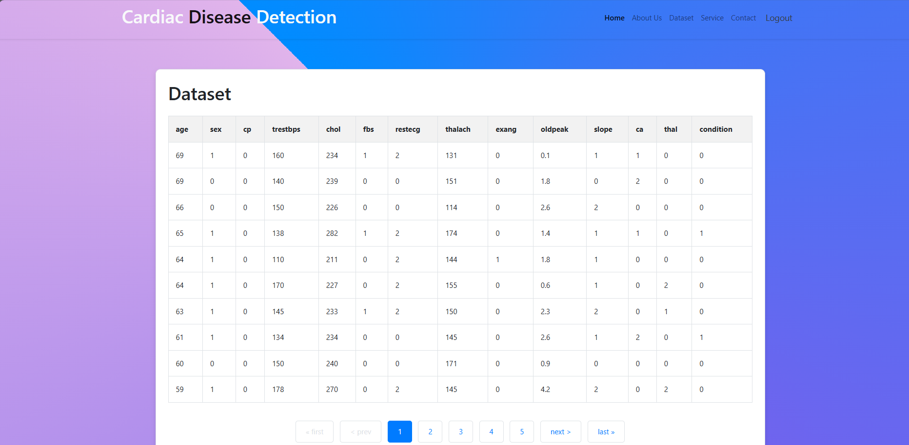
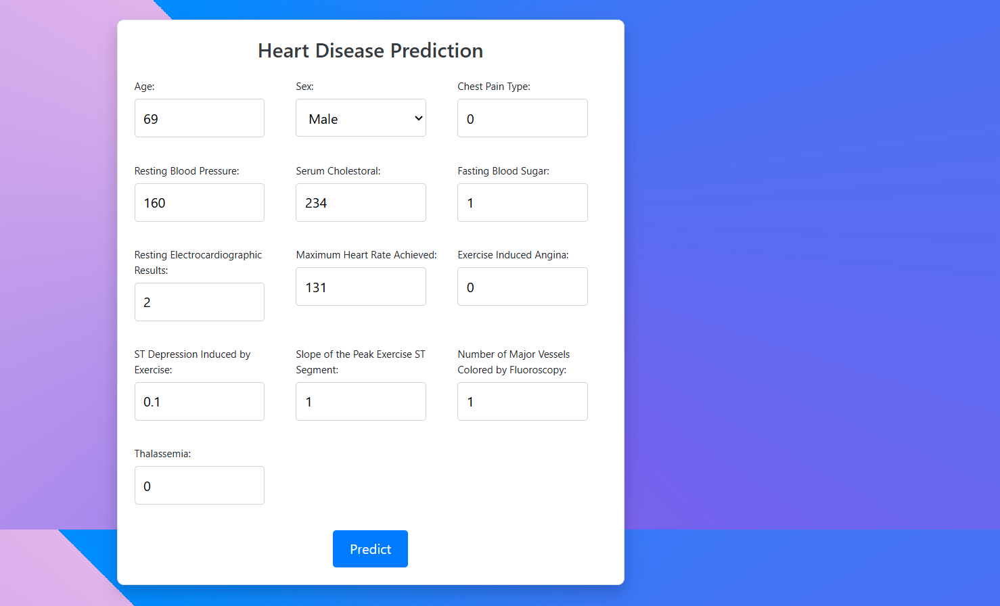
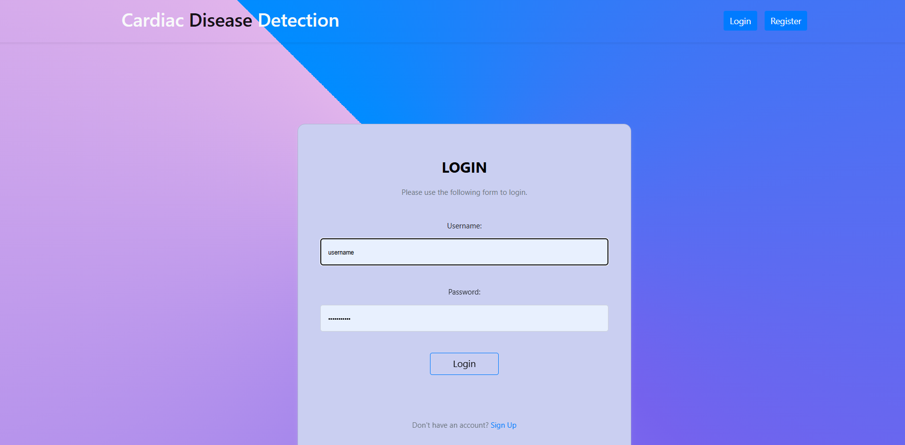
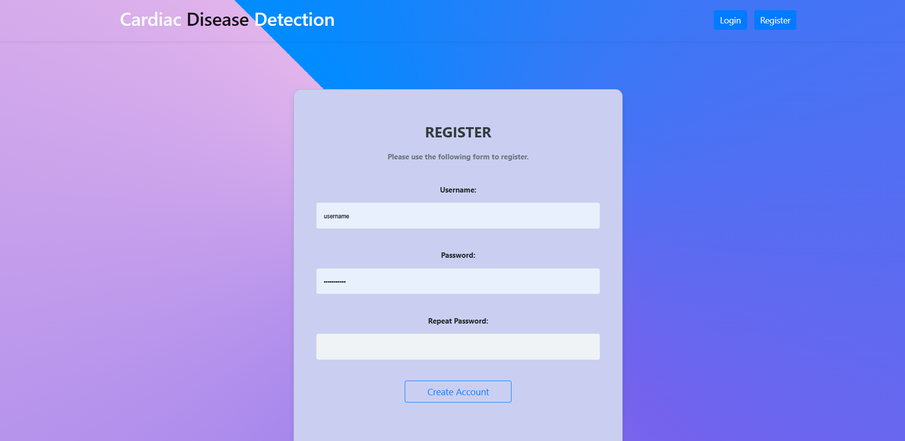
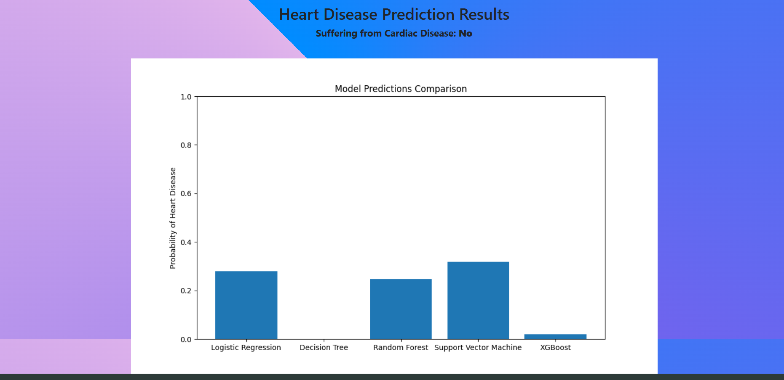

# Heart Disease Prediction

This project is a machine learning model that predicts whether a person has heart disease based on several medical attributes. The model uses various features such as age, sex, chest pain type, blood pressure, cholesterol levels, and more to determine the likelihood of heart disease.

## Features

The dataset includes the following features:

1. **age**: Age of the patient
2. **sex**: Gender of the patient (1 = male, 0 = female)
3. **cp**: Chest pain type (0: typical angina, 1: atypical angina, 2: non-anginal pain, 3: asymptomatic)
4. **trestbps**: Resting blood pressure (in mm Hg)
5. **chol**: Serum cholesterol in mg/dl
6. **fbs**: Fasting blood sugar (> 120 mg/dl, 1 = true, 0 = false)
7. **restecg**: Resting electrocardiographic results (0: normal, 1: having ST-T wave abnormality, 2: showing probable or definite left ventricular hypertrophy)
8. **thalach**: Maximum heart rate achieved
9. **exang**: Exercise-induced angina (1 = yes, 0 = no)
10. **oldpeak**: ST depression induced by exercise relative to rest
11. **slope**: Slope of the peak exercise ST segment (0: upsloping, 1: flat, 2: downsloping)
12. **ca**: Number of major vessels (0-3) colored by fluoroscopy
13. **thal**: Thalassemia (0: normal, 1: fixed defect, 2: reversible defect)
14. **condition**: Diagnosis of heart disease (1 = yes, 0 = no)

## Dataset

The dataset used in this project is available on Kaggle:

- [Heart Disease Dataset](https://www.kaggle.com/datasets/johnsmith88/heart-disease-dataset)

Example rows from the dataset:

| age | sex | cp  | trestbps | chol | fbs | restecg | thalach | exang | oldpeak | slope | ca  | thal | condition |
| --- | --- | --- | -------- | ---- | --- | ------- | ------- | ----- | ------- | ----- | --- | ---- | --------- |
| 69  | 1   | 0   | 160      | 234  | 1   | 2       | 131     | 0     | 0.1     | 1     | 1   | 0    | 0         |
| 69  | 0   | 0   | 140      | 239  | 0   | 0       | 151     | 0     | 1.8     | 0     | 2   | 0    | 0         |
| 66  | 0   | 0   | 150      | 226  | 0   | 0       | 114     | 0     | 2.6     | 2     | 0   | 0    | 0         |

## Models Used

The following machine learning models and techniques were implemented to predict heart disease:

- **Decision Tree**: A tree-like model used to classify data based on features.
- **Logistic Regression**: A statistical model that uses a logistic function to model a binary outcome.
- **Random Forest**: An ensemble of decision trees that improves accuracy by reducing variance.
- **SVM (Support Vector Machine)**: A supervised learning algorithm used for classification and regression.
- **XGBoost**: An optimized gradient boosting algorithm that provides high performance and accuracy.
- **PCA (Principal Component Analysis)**: A technique used for dimensionality reduction.
- **Scaler**: Data scaling and normalization using techniques like StandardScaler for improved model performance.

## Installation

To run this project locally, you'll need to set up a Python environment and install the necessary libraries.

1. Clone the repository:

```bash
git clone <repository-url>
```

2. Install the required dependencies:

```bash
pip install -r requirements.txt
```

3. Run the application:

```bash
python manage.py runserver
```

## Model

The machine learning model used in this project can be trained with various classification algorithms as listed above. The model predicts whether a patient is likely to have heart disease based on the provided features.

## Usage

Once the application is running, you can:

- Input medical data through a form on the frontend.
- The model will process the input data and return a prediction.
- The result will indicate whether heart disease is likely present or not.

## Screenshots

Here are some screenshots that demonstrate the functionality of the system:

- **Dataset Preview**  
  

- **Heart Disease Prediction Page**  
  

- **Home Page**  
  

- **Login Page**  
  

- **Register Page**  
  

- **Result Page**  
  


## Technologies Used

- **Python** for backend development
- **Django** for the web framework
- **SQLite** for database management
- **Machine Learning** libraries like `scikit-learn`, `XGBoost`
- **HTML/CSS/JavaScript** for frontend development
